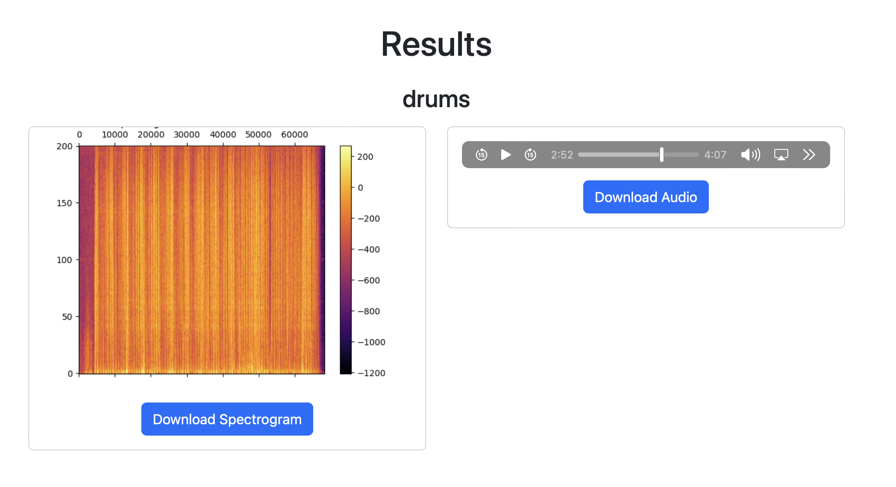

# VSPJ-PASU
Semestral work for PASU. Music source separation app wrapped into Flask so it can be run as a web app.
App is based on [Hybrid Spectrogram and Waveform Source Separation](https://arxiv.org/abs/2111.03600) paper by Alexandre Défossez and pytorch [MUSIC SOURCE SEPARATION WITH HYBRID DEMUCS](https://pytorch.org/audio/main/tutorials/hybrid_demucs_tutorial.html) tutorial.

## How to run
1. I suppose you have python3 installed
2. Create virtual environment
```
python3 -m venv venv
```
3. Activate virtual environment
```
source venv/bin/activate
```
4. Install requirements
```
pip install -r requirements.txt
```

5. Run the app
```
python3 app.py
```

## Docker compose
1. Build the image
```
docker-compose build
```
2. Run the container
```
docker-compose up
```

## How to use
1. Open the browser and go to http://localhost:5000/
2. Upload the audio file
3. Wait for the result. It may take a while.

